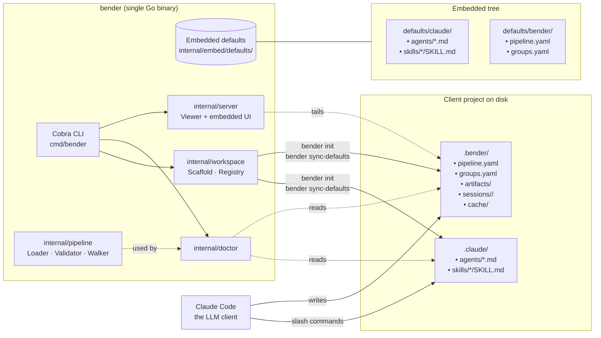
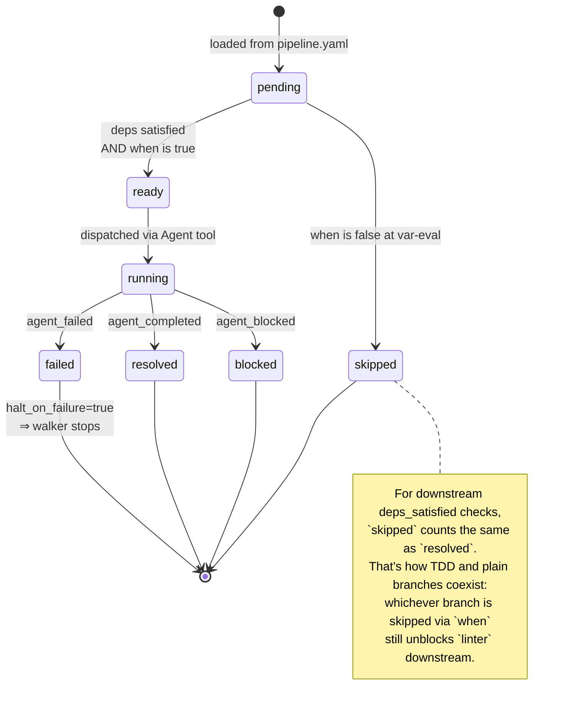
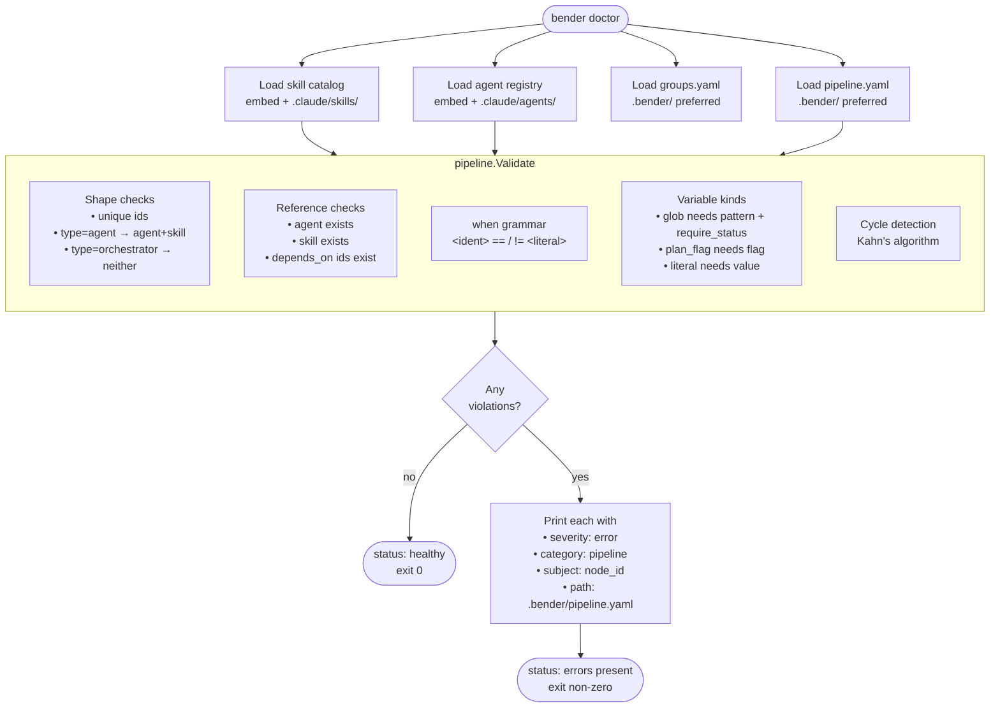
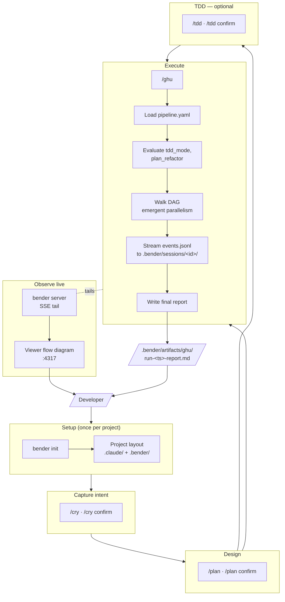

# ai-bender — end-to-end flow

This document maps the whole harness as Mermaid diagrams, from the user
installing the binary through to the viewer rendering a completed run.
Each diagram is scoped so it can be read in isolation; the numbered
section order mirrors how a real run unfolds.

---

## 1. System architecture

How the single Go binary, the embedded defaults, and the client project's
on-disk state relate. `.claude/` is Claude Code–native; `.bender/` is
bender-owned (both config and runtime).



**Reading tip**: the binary never invokes an LLM directly. Claude Code
reads the SKILL + agent files out of `.claude/`, consults
`.bender/pipeline.yaml` during `/ghu`, and writes session artefacts back
into `.bender/`. The binary only scaffolds, validates, and serves.

---

## 2. Lifecycle of one feature through the stages

The canonical left-to-right progression from a raw user intent to
shipped code. Each stage writes its output under `.bender/artifacts/`
and leaves a session dir under `.bender/sessions/`.

```mermaid
flowchart LR
    Intent[/"User intent<br/>e.g. 'add OAuth'"/] --> Cry

    subgraph Cry["/cry — capture"]
        direction TB
        CryDraft[Draft<br/>.bender/artifacts/cry/&lt;slug&gt;-&lt;ts&gt;.md<br/>status: draft<br/><b>session ends:<br/>awaiting_confirm</b>]
        CryConfirm[/cry confirm<br/>flip status: approved<br/><b>session ends:<br/>completed</b>]
        CryDraft --> CryConfirm
    end

    subgraph Plan["/plan — design"]
        direction TB
        PlanDraft[Draft plan set<br/>spec · data-model · api-contract ·<br/>risk-assessment · tasks<br/>status: draft<br/><b>awaiting_confirm</b>]
        PlanConfirm[/plan confirm<br/>flip all artifacts:<br/>status: approved]
        PlanDraft --> PlanConfirm
    end

    subgraph TDD["/tdd — optional"]
        direction TB
        TDDDraft[Prose test scaffolds<br/>.bender/artifacts/plan/tests/*.md<br/>status: draft]
        TDDConfirm[/tdd confirm<br/>status: approved<br/>→ triggers TDD branch in /ghu]
        TDDDraft --> TDDConfirm
    end

    subgraph Ghu["/ghu — execute"]
        direction TB
        GhuWalk[Load .bender/pipeline.yaml<br/>Walk DAG · Dispatch agents<br/>Emit events]
        GhuReport[Final report<br/>.bender/artifacts/ghu/run-&lt;ts&gt;-report.md]
        GhuWalk --> GhuReport
    end

    Cry --> Plan
    Plan --> TDD
    TDD -->|scaffolds approved| Ghu
    Plan -->|no scaffolds| Ghu

    Ghu --> Done[/"Shipped code<br/>+ findings"/]

    classDef pending fill:#e0af68,stroke:#b38a40,color:#000;
    class CryDraft,PlanDraft,TDDDraft pending;
```

**Key detail**: a draft stage session ends with
`status: awaiting_confirm`, not `completed`. Only the paired `<cmd> confirm`
session emits `status: completed`. The viewer renders this as an amber
pill on the draft row.

---

## 3. Anatomy of `.bender/pipeline.yaml`

The declarative DAG `/ghu` and `/implement` walk. Nodes with disjoint
dependencies fan out; `priority` breaks ties; `when` gates conditional
branches; `halt_on_failure` controls cascade.

```mermaid
flowchart TB
    subgraph Vars[variables]
        V1[tdd_mode<br/>glob_nonempty_with_status]
        V2[plan_refactor<br/>plan_flag]
    end

    Scout[scout<br/>bg-scout-explore<br/>priority 100]
    Architect[architect<br/>bg-architect-validate<br/>priority 100]
    Surgeon{{surgeon<br/>bg-surgeon-refactor<br/>priority 90<br/>when: plan_refactor == true}}

    Scout --> Architect
    Architect --> Surgeon

    subgraph TDDBranch["when: tdd_mode == true"]
        direction TB
        TddScaffold[tdd-scaffold<br/>tester · bg-tester-scaffold<br/>halt_on_failure: true]
        TddImpl[tdd-implement<br/>crafter · bg-crafter-implement<br/>halt_on_failure: true]
        TddVerify[tdd-verify<br/>tester · bg-tester-run<br/>halt_on_failure: true]
        TddScaffold --> TddImpl --> TddVerify
    end

    subgraph PlainBranch["when: tdd_mode == false"]
        direction LR
        PlainImpl[plain-impl<br/>crafter · bg-crafter-implement]
        PlainTests[plain-tests<br/>tester · bg-tester-write-and-run]
    end

    Architect --> TddScaffold
    Architect --> PlainImpl
    Architect --> PlainTests
    Surgeon -.-> TddScaffold
    Surgeon -.-> PlainImpl
    Surgeon -.-> PlainTests

    Linter[linter<br/>bg-linter-run-and-fix<br/>depends_mode: any-resolved<br/>priority 70]
    TddVerify --> Linter
    PlainImpl --> Linter
    PlainTests --> Linter

    subgraph ReviewTrio[Review trio — emergent parallel]
        direction LR
        Reviewer[reviewer<br/>bg-reviewer-critique]
        Sentinel[sentinel<br/>bg-sentinel-static-scan]
        Benchmarker[benchmarker<br/>bg-benchmarker-analyze]
    end

    Linter --> Reviewer
    Linter --> Sentinel
    Linter --> Benchmarker

    Scribe[scribe<br/>bg-scribe-update-docs<br/>priority 50]
    Reviewer --> Scribe
    Sentinel --> Scribe
    Benchmarker --> Scribe

    Report[["report<br/>type: orchestrator<br/>priority 10"]]
    Scribe --> Report

    classDef optional stroke-dasharray: 5 5,stroke:#e0af68;
    class Surgeon optional;

    classDef branch fill:#1a2029,stroke:#2a3242;
    class TDDBranch,PlainBranch branch;
```



**Emergent parallelism**: `plain-impl ∥ plain-tests` share `architect +
surgeon` as their dependencies, so they become `ready` in the same wave
and dispatch concurrently. Same story for `reviewer ∥ sentinel ∥
benchmarker` after `linter`. Nothing in the pipeline file calls out
"parallel" — the walker infers it from the DAG.

---

## 4. How the orchestrator walks the pipeline

The algorithm `/ghu` runs at dispatch time. Implemented by
`internal/pipeline/walker.go::DryRun` and mirrored in the `/ghu` SKILL
prose so the LLM's walk and the Go dry-run stay byte-identical.

```mermaid
flowchart TD
    Start([/ghu invoked]) --> Load[Load .bender/pipeline.yaml<br/>Reject unknown schema_version]
    Load --> Eval[Evaluate variables<br/>glob / plan_flag / literal]
    Eval --> EmitLoaded["emit orchestrator_decision<br/>decision_type: pipeline_loaded"]
    EmitLoaded --> Init[status &#91;n.id&#93; = 'skipped' if when&#40;n&#41; is false<br/>else 'pending']
    Init --> Loop

    Loop{Any 'pending' node<br/>with deps satisfied?}
    Loop -->|no| End([stage_completed])
    Loop -->|yes| Collect[Collect ready set<br/>deps_mode · when · status]

    Collect --> Sort[Sort by priority desc,<br/>then id asc]
    Sort --> Cap[Truncate to max_concurrent]
    Cap --> SizeCheck{|batch| >= 2?}

    SizeCheck -->|no| Single[emit agent_assignment<br/>dispatch ONE Agent call]
    SizeCheck -->|yes| OverlapCheck{write_scope.allow<br/>overlaps within batch?}

    OverlapCheck -->|yes| Aborted["emit parallel_dispatch_aborted<br/>reason: write_scope_conflict<br/>fall back to sequential"]
    OverlapCheck -->|no| Parallel["emit parallel_dispatch<br/>dispatch ALL Agent calls<br/>in ONE assistant message"]

    Single --> Await[Await subagent results]
    Parallel --> Await
    Aborted --> Await

    Await --> Terminals{For each<br/>dispatched node}
    Terminals -->|agent_completed| MarkResolved[status = 'resolved']
    Terminals -->|agent_failed<br/>halt_on_failure: true| Halt([stage_failed])
    Terminals -->|agent_failed<br/>halt_on_failure: false| MarkFailed[status = 'failed']
    Terminals -->|agent_blocked| MarkBlocked[status = 'blocked']

    MarkResolved --> Loop
    MarkFailed --> Loop
    MarkBlocked --> Loop
```

**Why the parallel-dispatch rule is sacred**: Claude's `Agent` tool only
runs calls concurrently when multiple tool-use blocks appear in the
**same assistant message**. One-per-turn dispatch silently serialises.
The walker's "emit one `parallel_dispatch` event, then fire all Agent
calls together" step is what makes emergent parallelism observable.

---

## 5. Node state transitions

A single node's journey across one `/ghu` run.



---

## 6. Event flow to the viewer

What the orchestrator writes, where it lands, and how the viewer picks
it up. Every event is one append to `events.jsonl`; the viewer tails
via SSE.

```mermaid
sequenceDiagram
    autonumber
    participant User
    participant CC as Claude Code<br/>(orchestrator)
    participant Sub1 as Subagent A<br/>(e.g. crafter)
    participant Sub2 as Subagent B<br/>(e.g. tester)
    participant FS as .bender/sessions/<id>/<br/>events.jsonl
    participant UI as bender-ui viewer

    User->>CC: /ghu
    CC->>FS: session_started
    CC->>FS: stage_started
    CC->>FS: orchestrator_decision<br/>(pipeline_loaded)

    rect rgb(40,48,65)
    Note over CC: Wave n — emergent batch of 2
    CC->>FS: orchestrator_decision<br/>(parallel_dispatch, node_ids=[A,B])
    par single assistant message
        CC-->>Sub1: Agent tool call
    and
        CC-->>Sub2: Agent tool call
    end
    Sub1->>FS: agent_started (crafter)
    Sub2->>FS: agent_started (tester)
    Sub1->>FS: skill_invoked (bg-crafter-implement)
    Sub2->>FS: skill_invoked (bg-tester-write-and-run)
    Sub1->>FS: file_changed (pkg/foo/bar.go)
    Sub2->>FS: file_changed (pkg/foo/bar_test.go)
    Sub1->>FS: skill_completed
    Sub2->>FS: skill_completed
    Sub1->>FS: agent_completed
    Sub2->>FS: agent_completed
    end

    FS-->>UI: SSE fsnotify tail<br/>(interleaved lines are fine)
    UI->>User: Flow diagram updates<br/>• trio node highlights<br/>• per-agent progress bars

    Note over CC,FS: ...walker continues with wave n+1...

    CC->>FS: stage_completed
    CC->>FS: session_completed (status: completed)
    FS-->>UI: Final snapshot<br/>verdict + report link
```



**Reading tip**: the `parallel_dispatch` event ALWAYS precedes the
`agent_started` events for its named nodes. That ordering is what the
viewer uses to lay out fan-out edges in the flow diagram — a missing
`parallel_dispatch` means the viewer draws sequential nodes even if the
runs happened concurrently, so the orchestrator MUST emit it.

---

## 7. `bender doctor` validation flow

What happens when a developer edits `.bender/pipeline.yaml` and runs
`bender doctor`.



Every violation is attributed to a node id (or the variable name, for
variable-kind issues). `bender doctor` completes in under 200 ms on a
20-node malformed pipeline; catching these at edit time avoids partial
`/ghu` sessions.

---

## 8. Everything, stacked

The single picture: developer → binary → Claude Code → pipeline walk →
session events → viewer.



---

## Quick glossary

| Term | Meaning |
|---|---|
| **Stage** | One slash command's worth of work: `/cry`, `/plan`, `/tdd`, `/ghu`, `/implement` |
| **Session** | One invocation of a stage; owns a directory `.bender/sessions/<id>/` |
| **Node** | One vertex in `.bender/pipeline.yaml`; dispatches to an agent/skill or runs as orchestrator work |
| **Batch / Wave** | The set of ready nodes the walker dispatches in a single assistant message |
| **Ready** | A node whose dependencies are all in `{resolved, skipped}` and whose `when` evaluates true |
| **Skipped-by-when** | A node whose `when` is false; treated as `resolved` for downstream deps |
| **Emergent parallelism** | Parallelism inferred from the DAG — two nodes with disjoint deps become ready together and fan out, no explicit flag needed |

---

## Where the authoritative algorithms live

- **Walker** — `internal/pipeline/walker.go::DryRun`
- **Validator** — `internal/pipeline/validator.go::Validate`
- **Variable evaluator** — `internal/pipeline/variables.go::EvaluateVariables`
- **Doctor wiring** — `internal/doctor/doctor.go::checkPipeline`
- **SKILL prose (LLM's copy of the walker)** — `internal/embed/defaults/claude/skills/ghu/SKILL.md` §"Walk the pipeline DAG"

The Go code is the source of truth; the SKILL prose is the LLM's view of
the same algorithm. They must stay byte-identical — that's a contract, not
a suggestion.
